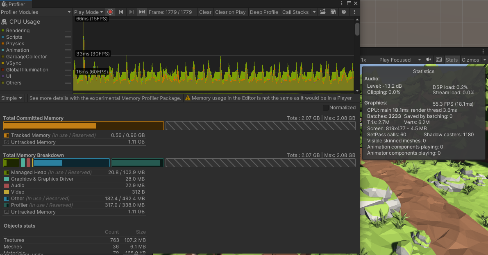
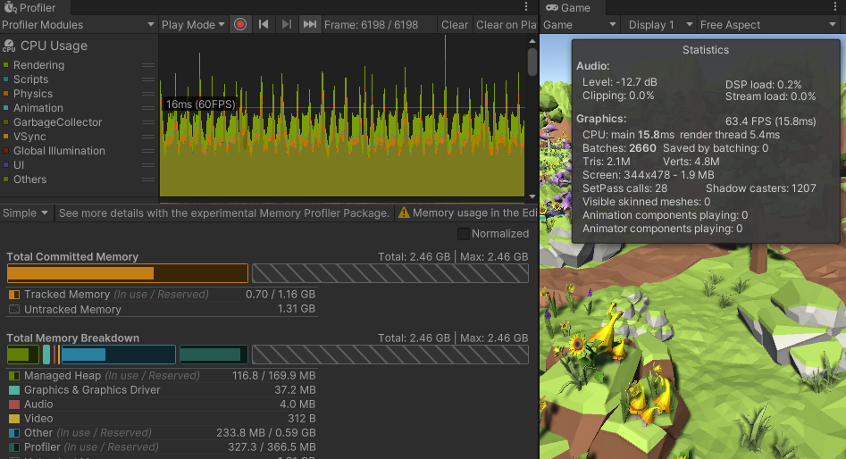

# MuhamadFaisal-Tugas7
Sample Game for practicing game optimization (reduce draw call, object pooling, resource load)

## AudioManager
Mengganti List<AudioSource> dengan AudioSource biasa, kemudian merandom path bgm nya. Jadi ketika di load hanya 1 AudioSource saja dan yang di random hanya alamat path dari Audio Clip nya.

**Before:**

**After:**

## SpriteAtlas
Membuat sebuah SpriteAtlas dengan package 2DSpriteShape, untuk Button

**Before:**

**After:**

## ObjectPool
Membuat pool untuk object mushroom yang dispawn terus menerus. Hasilnya ruang pada memory menjadi tidak padat.

**Before:**

**After:**

## Batching
Menggunakan Static Baching untuk Object-object yang memiliki texture sama, ditambah dengan shadow yang dimatikan. Hasilnya sistem dapat menggambar hingga hanya 4 buah object
