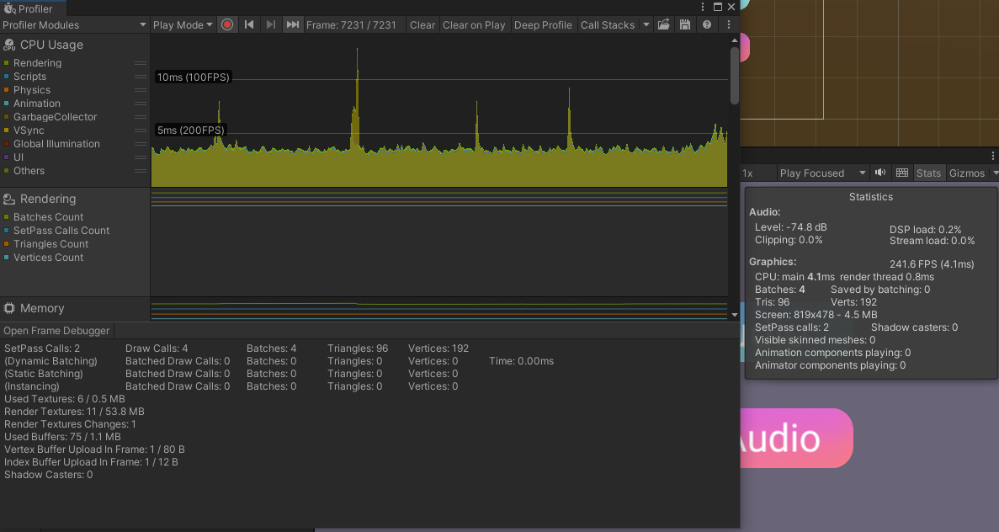
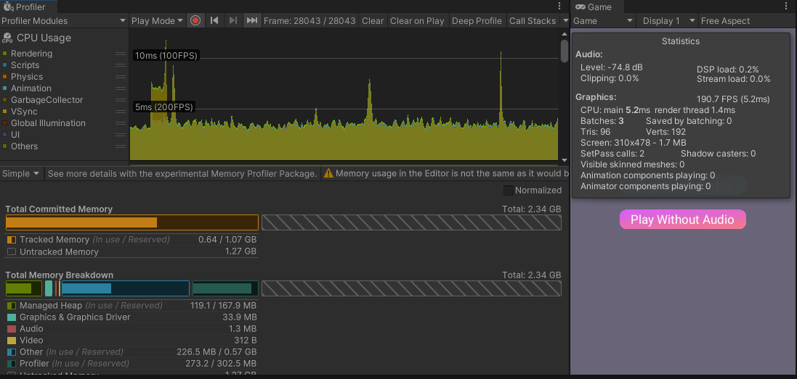

# MuhamadFaisal-Tugas7
Sample Game for practicing game optimization (reduce draw call, object pooling, resource load)

## AudioManager
Mengganti List<AudioSource> dengan AudioSource biasa, kemudian merandom path bgm nya. Jadi ketika di load hanya 1 AudioSource saja dan yang di random hanya alamat path dari Audio Clip nya.

**Before:**

**After:**

## SpriteAtlas
Membuat sebuah SpriteAtlas dengan package 2DSpriteShape, untuk Button

**Before:**

**after:**

